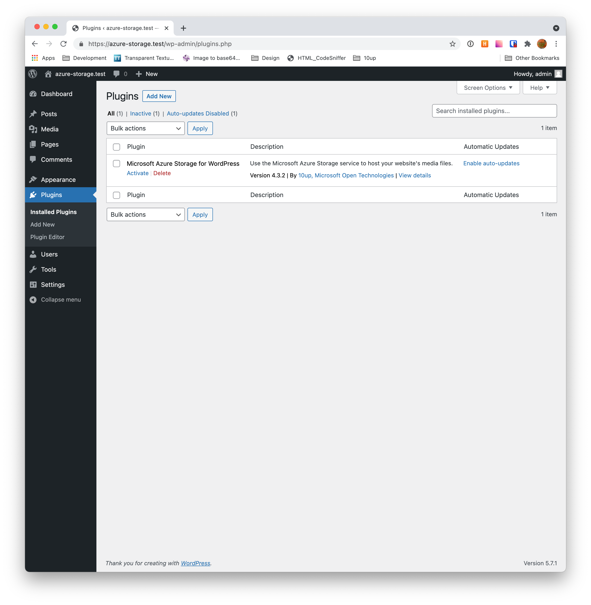
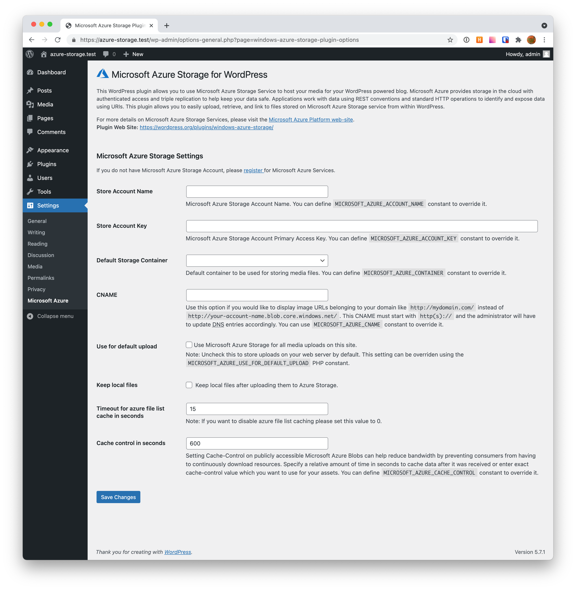
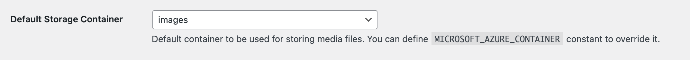
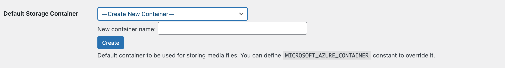

# User Guide

## Introduction

This WordPress plugin allows you to use the Microsoft Azure Storage service to host your media for your WordPress powered blog.  Microsoft Azure Storage is an effective way to scale storage of your site without having to go through the expense of setting up the infrastructure for content delivery.

## Features

Key features of this plug-in are listed below.

**Transparent Storage for End User**  
Actual storage location details are transparent to the end user.

**Automatic File Upload to Microsoft Azure Storage**  
Uploaded media files are automatically saved into your Microsoft Azure Storage Blob Container without any extra steps.  Media files will be served by Microsoft Azure Storage, instead of your own web host.

**Highly Configurable**  
This plugin provides several options for configuration of the underlying Microsoft Azure Storage service.

**Search Media Files**  
Provides ability to search media files based on criteria (like tag, file type, creation date etc.) provided by user. The plugin performs search using the Microsoft Azure Storage Services APIs available in the Microsoft Azure SDK for PHP.

## Target Users

**Personal blogging websites**  
You can use the Microsoft Azure Storage Plugin with your personal WordPress website. By using this plugin, you can avoid the time and money necessary to set up your own storage solution. Global account settings with a single Blob Container will allow you to store all your media (image files, music files, etc.) in Microsoft Azure Storage.

**WordPress blog hosters**  
WordPress hosters, such as www.wordpress.com and http://www.bluehost.com/track/wp/one can use the Microsoft Azure Storage plugin to reduce storage costs by storing millions of blog post media files in Microsoft Azure.

## Installation Instructions

- Extract the Microsoft Azure Storage plugin (windows-azure-storage) from the windows-azure-storage.zip archive and put it in the plugins directory of the WordPress installation.
- To activate the plugin, log in into your WordPress site as an administrator and navigate to list of plugins. Check the associated checkbox for the plugin and click **“Activate”**.

## Configure Microsoft Azure Storage Account

After activating the plugin, you need to configure it by providing your Microsoft Azure Storage Account credentials:

- Login into your WordPress site as an administrator and navigate to the Microsoft Azure” sub-tab (under the “Settings” tab).
- Enter your Microsoft Azure Storage account name in the **“Storage Account Name”** text box and enter your Microsoft Azure Storage primary access key in the **“Primary Access Key”** text box, then click “Save Changes”.
- If the underlying Web Server uses an HTTP proxy for connecting to the Internet, please provide the HTTP proxy server details in the **“HTTP Proxy Host Name”**, **“HTTP Proxy Port Name”**, **“HTTP Proxy User Name”** and **“HTTP Proxy Password”** fields. 
- After specifying **“Storage Account Name”**, **“Primary Access Key”** and proxy details you can create a container by entering the container name in the **“Create New Container”** text box and clicking “Create”.
  

- Once your Microsoft Azure Storage account details are set correctly, the page will be refreshed, and the “Default Storage Container” dropdown will be populated with all available blob containers associated with the storage account.
  

- Select the one container for storing your media files and click “Save Changes”. - If are no blob containers exist in your Microsoft Azure Storage account, then you will still see the “Create New Container” text box where you can enter container name and click on “Create” to create a container.
- If there are blob container(s) in the configured Microsoft Azure Storage account then you will not see the text box to create a new container. To create a new container select <Create New Container> option from the “Default Storage Container” drop down.

- All media files stored in Microsoft Azure Storage will have a URL like “http://<AccountName>.blob.core.windows.net/<ContainerName>/<MediaFileName>”. You can hide usage of the underlying Microsoft Azure Storage account by defining a CNAME entry in the “CNAME” text box and then clicking “Save Changes”. This CNAME must start with http(s) and you will have to update DNS entries appropriately to route requests back to blob.core.windows.net.
- You can set Microsoft Azure Storage as the default location for storing all media file uploaded via “WordPress upload tab”. File uploads will be automatically saved into your Microsoft Azure storage account. Just check the “Use Microsoft Azure Storage as default upload” checkbox and click “Save Changes”.
  
## Using with the Block Editor (aka Gutenberg)

By default, the plugin is not set to upload all files. You can and should change this. There are two ways:

- In the Azure settings, change the setting **Use For Default Upload** to true.
- You can also set the constant `MICROSOFT_AZURE_USE_FOR_DEFAULT_UPLOAD` to true for the same effect in the wp-config file. This setting will override the setting in the Azure settings.

It is recommended to set this to true if you plan on using Gutenberg.  All files will then uplaod to Azure and you can see them in the media library.

## Using with the Classic Editor

If you are using the Classic Editor, you can choose to leave the setting **Use For Default Upload** as false if you would like.  There is a special Azure media upload button that can be used instead.  This button will allow you to view and upload images to your Azure container.

## Resources
- For more details on Microsoft Azure Storage Services, please visit the [Azure Platform web-site](https://azure.microsoft.com/en-us/).
- Microsoft Azure SDK for PHP is at the core of this plugin. This SDK is available at https://github.com/WindowsAzure/azure-sdk-for-php
-  Official PHP on Microsoft Azure website: http://azurephp.interopbridges.com
